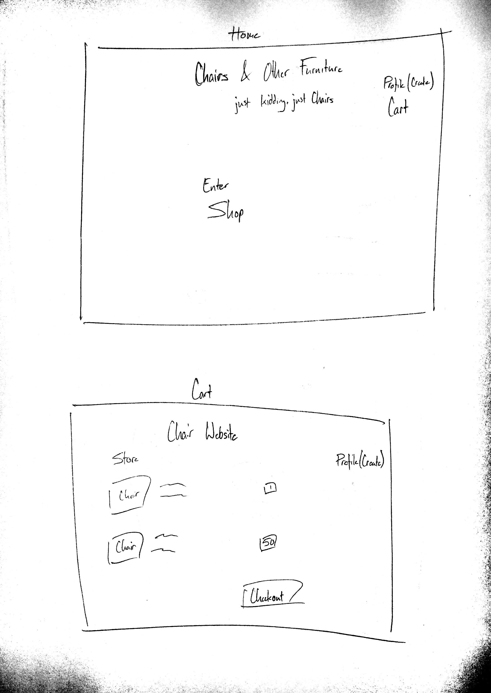
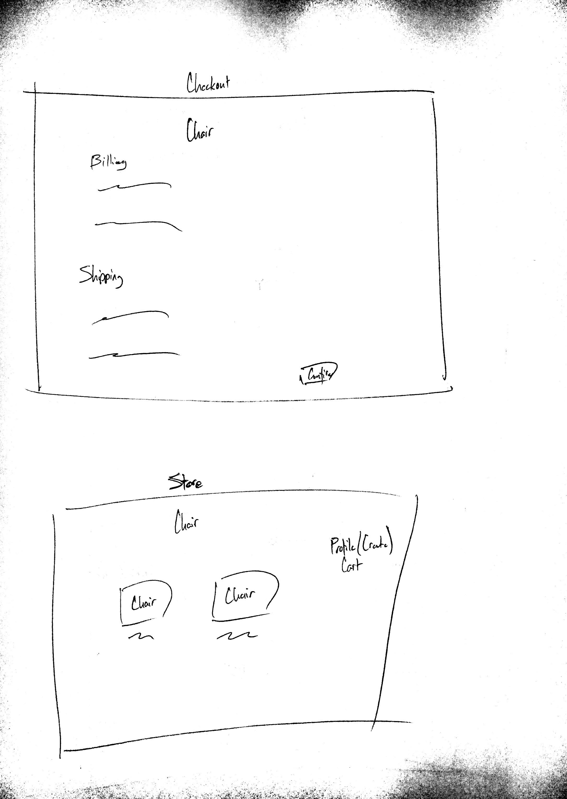
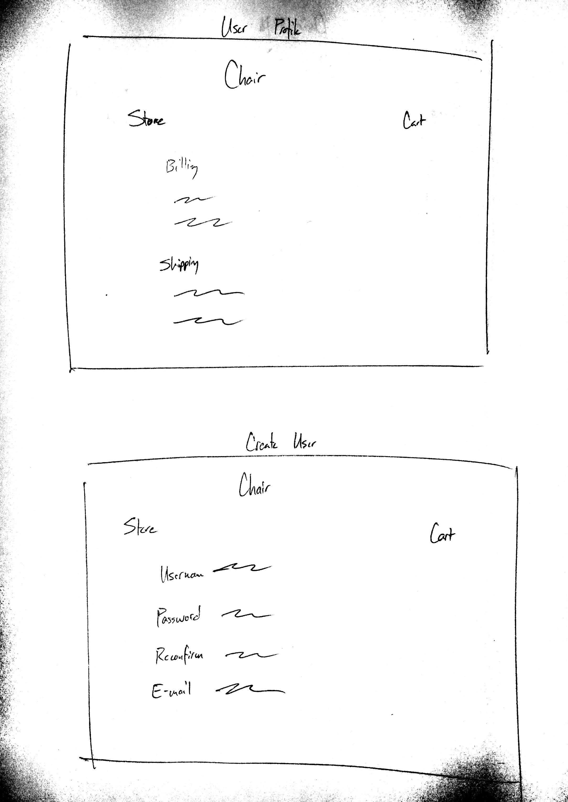
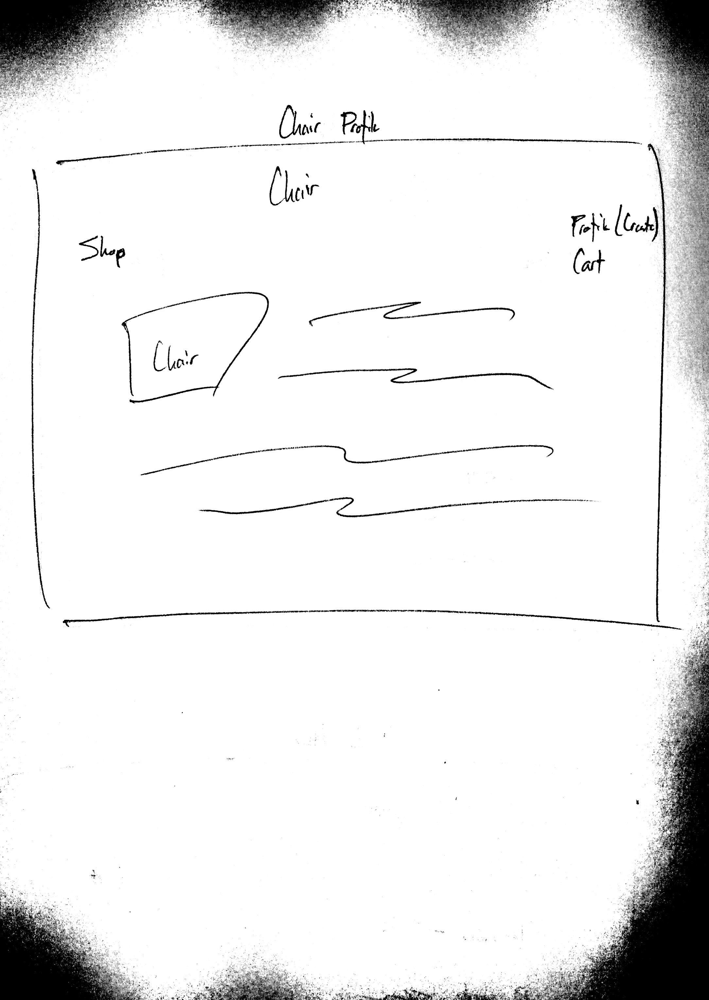
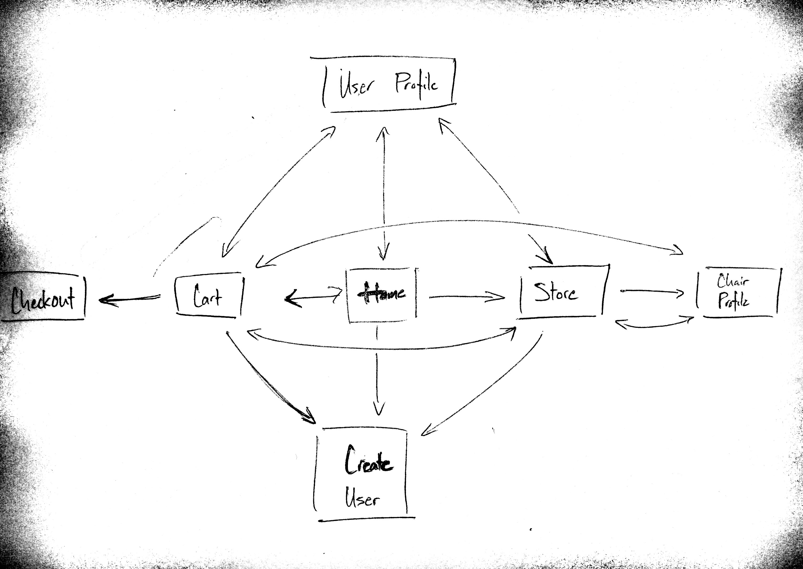

The content below is an example project proposal / requirements document. Replace the text below the lines marked "__TODO__" with details specific to your project. Remove the "TODO" lines.

(___TODO__: your project name_)

# RealFakeChairsDotCom

## Overview

(___TODO__: a brief one or two paragraph, high-level description of your project_)

Hello, this is my chair company's website. The chair company is not real, the website is. But are the chairs real? You'll find out if you buy one. Please enter your real credit card information (just kidding use 4242 4242 4242 4242, and random info in valid formats & dates) and home address (We don't prompt you for this information). Or don't, I'm not sure if my website will be able to tell the difference.

RealFakeChairsDotCom.com functions as a standard website any retail company for, working as their website wood. Hahaha. Please laugh. It's a pun because we only sell wooden chairs, even though that's not specified anywhere. We will allow users to register or not, up to them. If they plan on registering, their information can be stored to expedite the check out process. 

There are two chairs, there is no need for a search function. These chairs can also be placed in your cart so users can buy things in bulk.


## Data Model

(___TODO__: a description of your application's data and their relationships to each other_) 

The application will store Users, their information and cart data, and Chair metadata. 

* users have a singular cart (by embedding)
* each cart can have multiple chairs (by embedding)

(___TODO__: sample documents_)

An Example User:

```javascript
{
  username: "RealFakeUser",
  firstName: "User",
  lastName: "Name",
  billingAddress: "123 Street Street, New York, NY, 12345",
  shippingAddress: "123 Street Street, New York, NY, 12345",
  hash: // a password hash,
  cart: // contains embedded chairs
  orders: // contains embedded orders
}
```

An Example Chair:

```javascript
{
  name: "RealChair",
  image: "image.com",
  price: 120.00,
  description: "this is chair"
}
```

An Example Order:

```javascript
{
	date: Monday 12:00 12/20,
	price: 120.00,
	cart: [chairs],
	name: username, 
  billingAddress: "123 Street Street, New York, NY, 12345",
  shippingAddress: "123 Street Street, New York, NY, 12345",
}
```


## [Link to Commented First Draft Schema](db.js) 

(___TODO__: create a first draft of your Schemas in db.js and link to it_)

## Wireframes

(___TODO__: wireframes for all of the pages on your site; they can be as simple as photos of drawings or you can use a tool like Balsamiq, Omnigraffle, etc._)

/list/create - page for creating a new shopping list

/ - basic home screen for entering the website.

/cart - cart holding various chairs the user wishes to purchase.



/checkout - link to checkout and actually purchase items.

/store- place to view the chairs.



/user - user profile page

/user/create - creating a user profile.



/store/chair - actual viewing page for chair. 



## Site map

(___TODO__: draw out a site map that shows how pages are related to each other_)

Here's a [complex example from wikipedia](https://upload.wikimedia.org/wikipedia/commons/2/20/Sitemap_google.jpg), but you can create one without the screenshots, drop shadows, etc. ... just names of pages and where they flow to.



## User Stories or Use Cases

(___TODO__: write out how your application will be used through [user stories](http://en.wikipedia.org/wiki/User_story#Format) and / or [use cases](https://www.mongodb.com/download-center?jmp=docs&_ga=1.47552679.1838903181.1489282706#previous)_)

1. as non-registered user, I can register a new account with the site
2. as a user, I can log in to the site
3. as a user, I can place chairs into my cart
4. as a user, I can maintain cart between loggins 
5. as a user, I can place chairs into my cart
6. as a user, I can buy chairs
7. as a user, I can input and save my shipping and billing information
8. as a user, I can view past orders

## Research Topics

(___TODO__: the research topics that you're planning on working on along with their point values... and the total points of research topics listed_)

* (5 points) Integrate user authentication
    * I'm going to be using passport for user authentication
    * And account has been made for testing; I'll email you the password
    * see <code>cs.nyu.edu/~jversoza/ait-final/register</code> for register page
    * see <code>cs.nyu.edu/~jversoza/ait-final/login</code> for login page
* (3 points) Stripe API, used in the checkout process. 
	* I have no idea what this is, but apparently it's used in other stores in checkout
	* I have learned what it is, it's used to send me money

8 points total out of 8 required points (___TODO__: addtional points will __not__ count for extra credit_)


## [Link to Initial Main Project File](app.js) 

(___TODO__: create a skeleton Express application with a package.json, app.js, views folder, etc. ... and link to your initial app.js_)

## Annotations / References Used

(___TODO__: list any tutorials/references/etc. that you've based your code off of_)

1. [passport.js authentication docs](http://passportjs.org/docs) - (add link to source code that was based on this)
2. [tutorial on stripe api](https://stripe.com/docs/api) - (add link to source code that was based on this)
